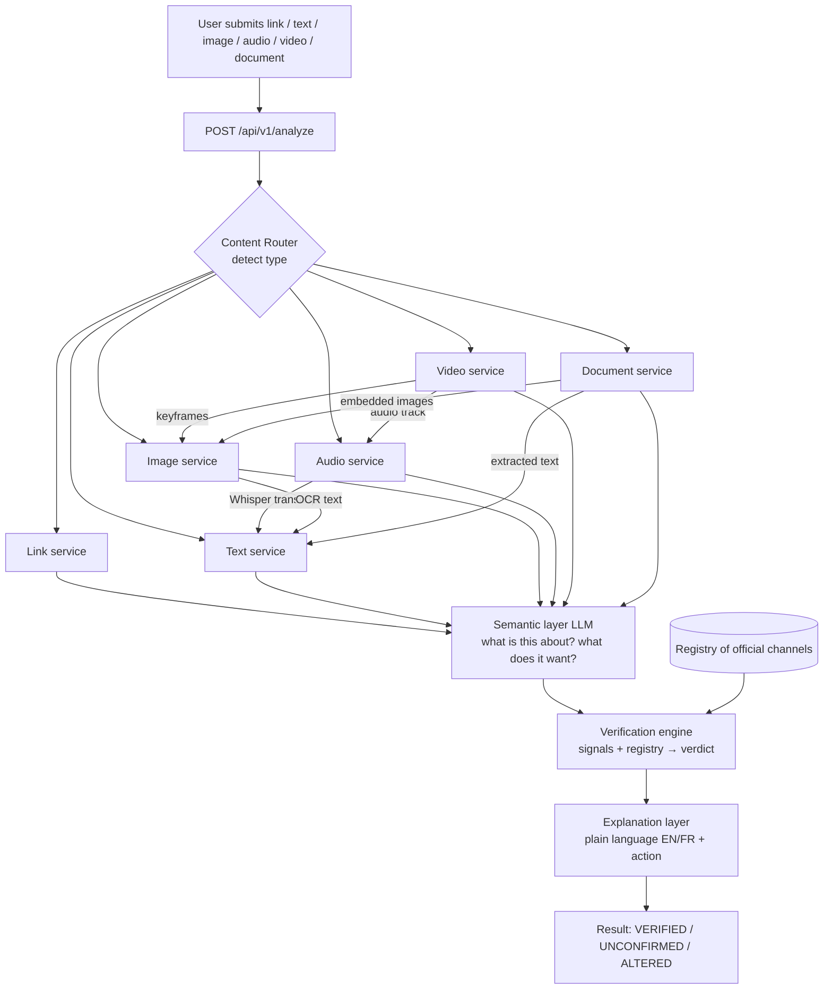

# 237Sentinel — API

> **You send us something. We tell you if it's real, and why.**

237Sentinel is a digital verification platform for Cameroon. Citizens send it
anything suspicious they receive online — a link, a pasted message, an image, a
voice note, a video, or a PDF — and it tells them whether to trust it, and why,
in plain language, in English or French.

This repository is the **backend**: a FastAPI service that routes each
submission to the right analysis, reads what the content is actually *about*,
checks it against a registry of known official channels, and returns a single
honest verdict with a plain-language explanation.

The frontend lives in [`237sentinel-web`](https://github.com/JohnnyPoks/237sentinel-web).

## The three verdicts

The system answers *"is this what it claims to be, and is it from who it claims
to be from?"* — **never** *"was AI involved?"*. Every analysis resolves to one
of exactly three states:

| Verdict | Plain meaning | When |
|---|---|---|
| **VERIFIED** | "This is really them." | The sender matched a registered official channel and there is no strong sign of manipulation. |
| **UNCONFIRMED** | "We cannot confirm this." | Not in the registry, and no strong evidence either way. **This is the honest default and the most common result.** Not-in-registry never means *fake*. |
| **ALTERED** | "This was altered." | Strong forensic evidence that media was synthesised or changed. |

## Why it exists

Cameroon lost over **1.027 billion FCFA** to online scams in 2025. The recurring
pattern is that detection happens *after* the money is gone — a forged ministry
communiqué spreads for days before fact-checkers debunk it by hand. 237Sentinel
puts that check in the hands of the person who received the message, in seconds,
before they act.

## Architecture



The **semantic layer** is the core idea: every other tool stops at "this video is
87% deepfake", which is useless to a citizen. We combine the forensic signal
with an understanding of *what the content claims to be and what it asks the
person to do*. Neither alone is a verdict. See [docs/ARCHITECTURE.md](docs/ARCHITECTURE.md).

## Run locally

Requires Python 3.11 (3.10 also works locally).

```bash
python -m venv .venv
source .venv/Scripts/activate      # Windows Git Bash; use .venv/bin/activate on Linux/mac
pip install -r requirements.txt
cp .env.example .env               # defaults work with zero API keys
python -m scripts.seed             # seed the registry + scam patterns
uvicorn app.main:app --reload --port 7860
```

Then open <http://localhost:7860/api/v1/docs>.

With the default `.env`, the app runs with **no API keys at all**: the LLM
provider is `none` (a deterministic rule-based fallback for the semantic and
explanation layers), and the database falls back to a local SQLite file. Model
weights download from Hugging Face lazily on first use.

### Enabling the LLM

Set `LLM_PROVIDER` to `anthropic`, `openai`, or `hf` and provide the matching
key in `.env`. The rest of the codebase never knows which backend is used.

## Deploy — Hugging Face Spaces (Docker)

The `Dockerfile` and the YAML frontmatter at the top of this README configure a
Docker Space (`sdk: docker`, `app_port: 7860`).

```bash
huggingface-cli login
huggingface-cli repo create 237sentinel-api --type space --space_sdk docker
git remote add space https://huggingface.co/spaces/<user>/237sentinel-api
git push space main
```

Set secrets (`DATABASE_URL`, `LLM_PROVIDER`, API keys, `ADMIN_TOKEN`) in the
Space **Settings → Variables and secrets** — never commit them. The Space
filesystem is ephemeral, so **`DATABASE_URL` must point at Postgres** (Supabase
or Neon) in production; without it the app uses SQLite, which is wiped on
restart.

## Environment variables

See [`.env.example`](.env.example) for the full list. The important ones:

| Var | Purpose | Default |
|---|---|---|
| `DATABASE_URL` | Postgres connection string. **Required in production.** | SQLite fallback |
| `LLM_PROVIDER` | `anthropic` \| `openai` \| `hf` \| `none` | `none` |
| `CORS_ORIGINS` | Comma-separated allowed origins | localhost:5173 |
| `RATE_LIMIT_PER_HOUR` | Free-tier analyses per IP per hour | 20 |
| `RATE_LIMIT_VIDEO_PER_HOUR` | Video is the expensive path, capped lower | 5 |
| `STORE_MEDIA` | Store submitted media (only with consent) | false |
| `ADMIN_TOKEN` | Enables `/api/v1/admin` (disabled if unset) | unset |
| `TELEGRAM_BOT_TOKEN` | Enables the Telegram bot; API runs fine without it | unset |

## Data protection

This maps to **Law No. 2024/017 on Personal Data Protection** (compliance window
closed 23 June 2026).

- We never store raw IP addresses — only a salted, per-process hash used for rate
  limiting and de-duplicating "this happened to me too" confirmations.
- Analyses keep a **short, redacted preview** of the content, never the full
  submission, and personal identifiers (phone numbers, emails) are stripped from
  anything that feeds the community feed or the pattern layer.
- Submitted **media is stored only with explicit consent** (`STORE_MEDIA=false`
  by default) and auto-purges after `MEDIA_RETENTION_DAYS` (30).

## Current limitations

Being explicit here is worth more than any claim.

- **It does not read Camfranglais or Pidgin.** English and French only. No
  off-the-shelf model handles Cameroonian Pidgin or Camfranglais; the future path
  is a community-collected phrase database, not a model.
- **It does not check SIM-swap status.** That needs a telecom partnership.
- **WhatsApp is scaffolded, not live** — it needs Business API approval.
- **Field accuracy is unknown and will be lower than the published benchmarks.**
  Those figures were measured on clean studio data; real users send WhatsApp
  voice notes recorded in a market. We report confidence *bands*, and say "we
  cannot confirm" when the evidence is thin. See [docs/MODELS.md](docs/MODELS.md).
- **Video** is analysed by keyframes + audio track, not full-video inference —
  a deliberate choice to fit a free CPU Space (see docs/ARCHITECTURE.md).

## Documentation

- [docs/ARCHITECTURE.md](docs/ARCHITECTURE.md) — the pipeline in detail
- [docs/MODELS.md](docs/MODELS.md) — every model, its real benchmark, its honest limit
- [docs/API.md](docs/API.md) — endpoints with curl examples
- [CLAUDE.md](CLAUDE.md) — conventions and gotchas for future work
- [DECISIONS.md](DECISIONS.md) — the choices made and why

## License

MIT — see [LICENSE](LICENSE).
